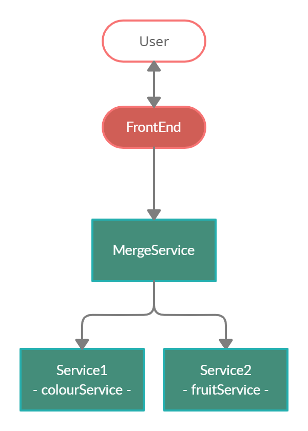
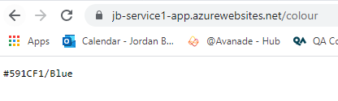
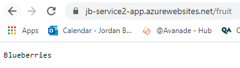
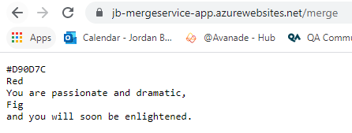
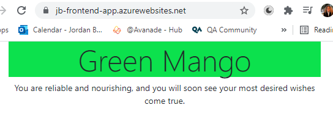
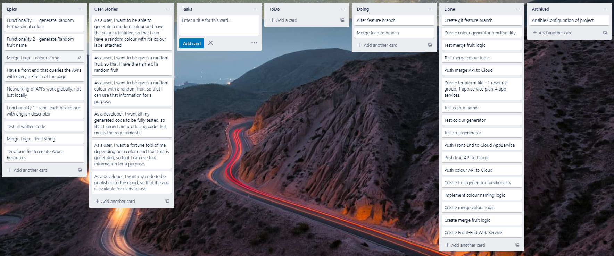
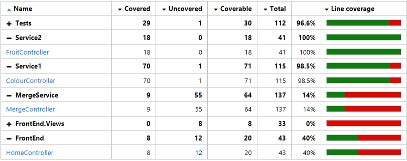
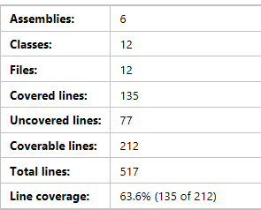

# Fruit and Colour Predictor
This is my implementation of a 4 service application. This application consists of a front-end Web App that is interacted with by the user. This service invokes a second service that produces the content to be shown on the front-end Web App. This service invokes two other services that each produce half of the information needed by the second service to produce the final content.

# Table of Contents
1. [Fruit and Colour Predictor](#Intro)
2. [Technologies Used](#technologiesused)
3. [Development](#development)
    
    2.1 [Requirements](#requirements)
    
    2.2 [User Stories](#userstories)

    2.3 [Trello Board](#trelloboard)
4. [Architecture](#architecture)
    4.1 [CI Pipeline](#ci)
5. [Risk Assesment](#risk)
6. [Testing](#test)
7. [Feature Branch](#featurebranch)
8. [Issues and Improvements](#issues)

## Fruit and Colour Predictor 

### Service One 
The first implemented service of this application is a random **colour** generator. The colour is generated using random hexidecimal RGB values. The colour name is then assigned using a series of thresholds.

**getColourString()** - logic that takes a RGB string and outputs a lable for that colour.
**getRGBHexValue()** - generates a random hexidecimal value.
**getColour()** - HTTPGet request function; using the two above functions, generates a hexidecimal RGB colour and a label for that colour.

*This service is deployed as an Azure Web App: [Colour Service](https://jb-service1-app.azurewebsites.net/colour).*

### Service Two
The second service implemented is a random **fruit** generator. With a defined array of 32 fruits, as random number is generated to index into the random fruit name. 

**getIndex()** - generates random number between 0 and the max length of the array.
**getFruit()** - using a given index, the array is accessed to produce the random fruit.
**getFruit()** - HTTPGet request; generates a random index and then fetches the random fruit.

*This service is deployed as an Azure Web App: [Fruit Service](https://jb-service2-app.azurewebsites.net/fruit).*

### Merge Service
The third API service invokes the two previous API's and uses it's own login on the gained data to produce the final data to be see by the user. This *fortune teller* style logic works using switch statements depending on the values given by the two respective API's.

**colourLogic()** - takes in colour label as a string and returns a corresponding string with a description of the user based on the colour given to them, using a switch statement. The theory behind the meaning of the colours was found [here](https://graf1x.com/color-psychology-emotion-meaning-poster/).
**fruitLogic()** - takes in fruit name as a string and returns a corresponding string with a prediction of the users future, based on the fruit given to them, using a switch statement.  
**Get()** - HTTPGet Request; using configuration settings of the mergeController, the colourServiceURL and fruitServiceURL are obtained (stored in appsettings.json locally, and stored in application settings on Azure Web Apps), each API, colourService and fruitService, is called and the data is returned. Using the two above functions, the logic of the mergeController is applied and concatonated. This string is then sent in the HTTP request.  

*This service is deployed as an Azure Web App: [Merge Service](https://jb-mergeService-app.azurewebsites.net/merge).*

### FrontEnd
The user facing application invokes only the merge service and displays the data taken. The frontend displays the specific RGB colour randomly generated along with the colour label and the fruit, then displays the fortune. There is minimal logic in the section of the application, mainly just string manipulation. With every re-fresh of the page a new fortune is told.

**Index()** - makes an API call to mergeService, which is done using the mergeServiceURL (stored in appsettings.json locally, and in application settings on Azure Web Apps). The response string is the split and formatted into ViewBags to be used in Index.cshtml.

*This service is deployed as an Azure Web App: [FrontEnd](https://jb-frontend-app.azurewebsites.net/).*

## Technologies Used 
This application consist of a ASP.NET Core MVC Web Application, for the front-end, and three ASP.NET Web API Applications, for the services. Each application is deployed to Azure Web App Service, which is deployed automatically using Terraform. CI/CD functionality is done through GitHub Actions.

* ASP.NET MVC
* ASP.NET API
* C#
* Git
* GitHub Actions
* Azure Web App Service
* Trello

## Development 

### Requirements 
* 
### User Stories 
* As a 
* 
### Trello Board 

## Architecture 
### CI Pipeline 
This was the aimed CI Pipeline implementation

## Risk Assesment 
A lot of the risk associated with this project came from 

## Testing 

## Feature Branch 

## Issues and Improvements 
### Issues
Issues I see:

### Improvements
I would like to improve:

### Additional Features
I would like to add:
