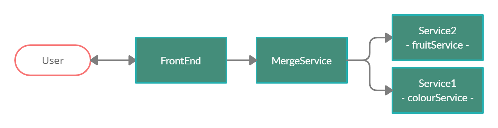
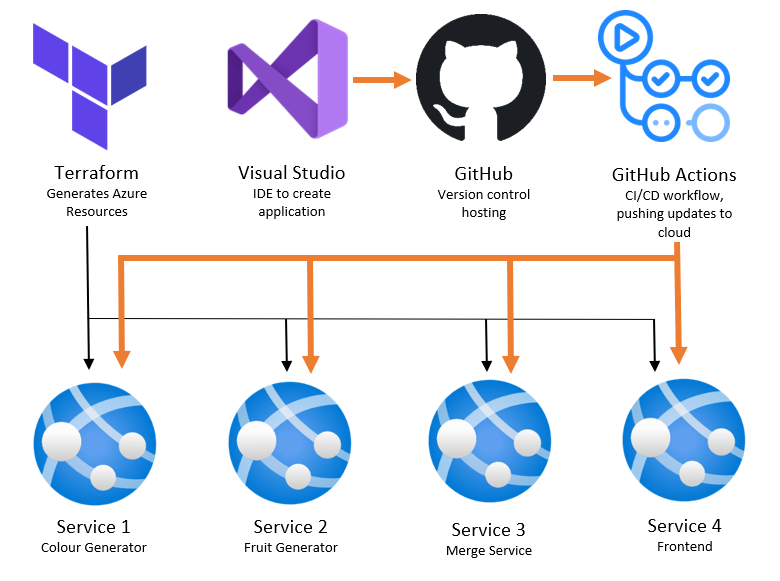
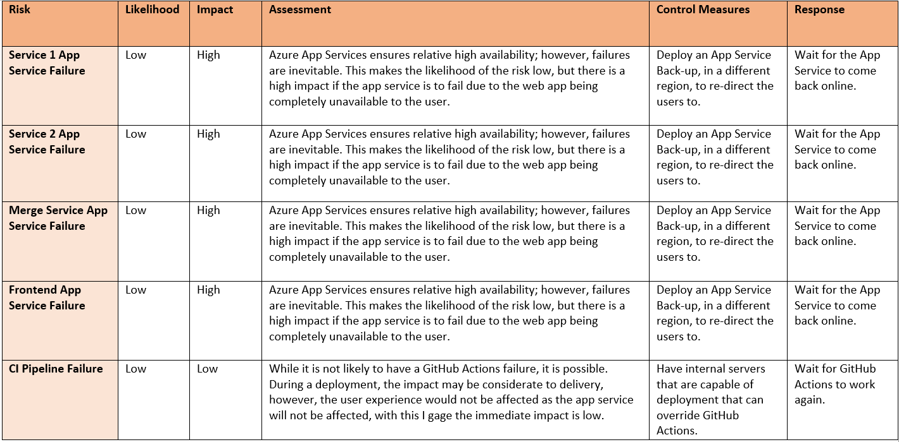
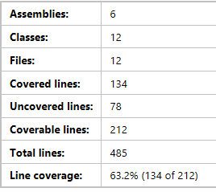

# Fruit and Colour Fortune Teller
This is my implementation of a 4 service application. This application consists of a front-end Web App that is interacted with by the user. This service invokes a second service that produces the content to be shown on the front-end Web App. This service invokes two other services that each produce half of the information needed by the second service to produce the final content.

# Table of Contents
1. [Fruit and Colour Fortune Teller](#Intro)
2. [Technologies Used](#technologiesused)
3. [Development](#development)
    
    2.1 [Requirements](#requirements)
    
    2.2 [User Stories](#userstories)

    2.3 [Trello Board](#trelloboard)
4. [CI Pipeline](#ci)
5. [Risk Assesment](#risk)
6. [Testing](#test)
7. [Feature Branch](#featurebranch)
8. [Issues and Improvements](#issues)

## Fruit and Colour Fortune Teller 

### Service One 
The first implemented service of this application is a random **colour** generator. The colour is generated using random hexidecimal RGB values. The colour name is then assigned using a series of thresholds.

**getColourString()** - logic that takes a RGB string and outputs a lable for that colour.

**getRGBHexValue()** - generates a random hexidecimal value.

**getColour()** - HTTPGet request function; using the two above functions, generates a hexidecimal RGB colour and a label for that colour.

*This service is deployed as an Azure Web App: [Colour Service](https://jb-service1-app.azurewebsites.net/colour).*

### Service Two
The second service implemented is a random **fruit** generator. With a defined array of 32 fruits, as random number is generated to index into the random fruit name. 

**getIndex()** - generates random number between 0 and the max length of the array.

**getFruit()** - using a given index, the array is accessed to produce the random fruit.

**getFruit()** - HTTPGet request; generates a random index and then fetches the random fruit.

*This service is deployed as an Azure Web App: [Fruit Service](https://jb-service2-app.azurewebsites.net/fruit).*

### Merge Service
The third API service invokes the two previous API's and uses it's own login on the gained data to produce the final data to be see by the user. This *fortune teller* style logic works using switch statements depending on the values given by the two respective API's.

**colourLogic()** - takes in colour label as a string and returns a corresponding string with a description of the user based on the colour given to them, using a switch statement. The theory behind the meaning of the colours was found [here](https://graf1x.com/color-psychology-emotion-meaning-poster/).

**fruitLogic()** - takes in fruit name as a string and returns a corresponding string with a prediction of the users future, based on the fruit given to them, using a switch statement.  

**Get()** - HTTPGet Request; using configuration settings of the mergeController, the colourServiceURL and fruitServiceURL are obtained (stored in appsettings.json locally, and stored in application settings on Azure Web Apps), each API, colourService and fruitService, is called and the data is returned. Using the two above functions, the logic of the mergeController is applied and concatonated. This string is then sent in the HTTP request.  

*This service is deployed as an Azure Web App: [Merge Service](https://jb-mergeService-app.azurewebsites.net/merge).*

### FrontEnd
The user facing application invokes only the merge service and displays the data taken. The frontend displays the specific RGB colour randomly generated along with the colour label and the fruit, then displays the fortune. There is minimal logic in the section of the application, mainly just string manipulation. With every re-fresh of the page a new fortune is told.

**Index()** - makes an API call to mergeService, which is done using the mergeServiceURL (stored in appsettings.json locally, and in application settings on Azure Web Apps). The response string is the split and formatted into ViewBags to be used in Index.cshtml.

*This service is deployed as an Azure Web App: [FrontEnd](https://jb-frontend-app.azurewebsites.net/).*

## Technologies Used 
This application consist of a ASP.NET Core MVC Web Application, for the front-end, and three ASP.NET Web API Applications, for the services. Each application is deployed to Azure Web App Service, which is deployed automatically using Terraform. CI/CD functionality is done through GitHub Actions.

* ASP.NET MVC
* ASP.NET API
* C#
* Git
* GitHub Actions
* Azure Web App Service
* Trello
* Terraform

## Development 

### Requirements 
* Service 1
    * Colour Generator
    * API Service
    * Deployed to Web App
* Service 2
    * Fruit Generator
    * API Service
    * Deployed to Web App
* Service 3
    * Merge Service 1 and Service 2 through API calls
    * Apply fortune logic
    * API Service
    * Deployed to Web App
* Service 4
    * User Interface
    * Call Service 3 through API call
    * Deployed to Web App

### User Stories 
* As a user, I want to be able to generate a random colour and have the colour identified, so that I can have a random colour with it's colour label attached.
* As a user, I want to be given a random fruit, so that I have the name of a random fruit.  
* As a user, I want to be given a random colour with a random fruit, so that I can use that information for a purpose.
* As a developer, I want all my generated code to be fully tested, so that I know I am producing code that meets the requirements stated.
* As a user, I want a fortune to be told depending on a colour and fruit that is generated, so that I can use that information for a purpose.
* As a developer, I want my code to be published to the cloud, so that the app is available for users to use.

### Trello Board 

## CI Pipeline 

This is the CI Pipeline implementation. Using Terraform, the Azure resources are created and managed. The creation, management and deployment of the code to the Azure resources is managed by Visual Studio, GitHub and GitHub Actions, respectively. The orange arrows indicate the automated CI Pipeline that is run whenever the main branch of the Git repo is pushed to. 

### Terraform
The terraform deployment creates and manages 6 resources within Azure.
* Resource Group
* App Service Plan
* 4 App Services

### Yml
The yml file generates 5 steps within it.
* **Test** - deploys testing.
* 
* **Build and Deploy Service 1** - builds and deploys the pushed code to the Azure App Service.
* 
* **Build and Deploy Service 2** - builds and deploys the pushed code to the Azure App Service.
* 
* **Build and Deploy Merge Service** - builds and deploys the pushed code to the Azure App Service.
* 
* **Build and Deploy FrontEnd** - builds and deploys the pushed code to the Azure App Service.

## Risk Assesment 
A lot of the risk associated with this project came from it's being hosted in the Cloud and the risks that come with cloud hosting. There is never full security and servers are prone to failures, so there are some precautions to take.

## Testing 
All controllers were tested using xUnit testing with a code coverage report generated by the extension Fine Code Coverage.

* xUnit 
* Moq
* Fine Code Coverage

**Achieved 63.2% code coverge.**

**FruitController** - Fully tested.

**ColourController** - Almost fully tested, however due to a large switch statement it was difficult to get testing to 100%.

**MergeService** - Constructor only tested, due to failing HTTP requests and having to keep all non API functions private.

**HomeController** - Constructor only tested, due to failing HTTP requests. 

## Feature Branch 
I will now deploy the feature branch.

## Issues and Improvements 
Issues I see and would like to improve:
* Obviously the colour labelling logic isn't perfect, so ideally would love to come up with an algorithim that successfully labels any hexidecimal colour. 
* The testing, as it is not the most comprehensive and could lead to issues further down the line.

I would like to add:
* The use of more API's, to flesh out the functionality of the application, as it is clearly very basic at the moment, but the architecture itself could to be quite useful.
